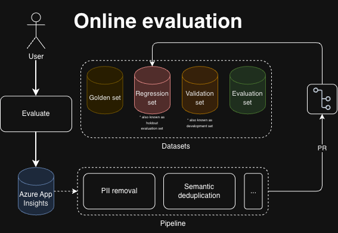
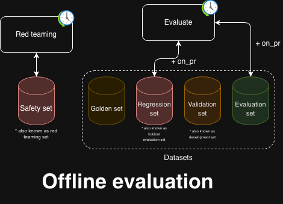

<h1 align="center"> Cosmopilot</h1>

<p align="center">
  
</p>

<p align="center">A demo of the beautiful things we can achieve when we combine all of what Microsoft Foundry has to offer.</p>

<!-- latest-feature:start -->
<!-- latest-feature:end -->

<p align="center">
  <a href="LICENSE"></a>
  <a href="LICENSE"></a>
  <a href="https://github.com/NicoGrassetto/Cosmopilot/codespaces"></a>
  <a href="https://github.com/NicoGrassetto/Cosmopilot"></a>
</p>

Cosmopilot is a demo showcasing Microsoft Foundry as your AI platform choice. This repo aims at covering every feature Microsoft Foundry offers (GA and Preview) in a somewhat standardised repo structure drawn from what I've observed at my customers and through the Microsoft documentation and OS IP. This does not reflect in any shape of form what YOU should be doing but merely shows you how Microsoft and other folks organise these things.

> [!WARNING]
> This project is simply a demo of Microsoft Foundry capabilities and is intended solely for exploration and validation purposes. 

---

## Project Structure

```text
Cosmopilot/
├── backend/                # FastAPI bridge to Microsoft Foundry
│   ├── app.py
│   └── requirements.txt
├── frontend/               # React application powered by Vite
│   └── src/
│       ├── components/
│       ├── api.js
│       └── App.jsx
├── src/
│   ├── agents/             # Foundry agent definitions and shared helpers
│   │   ├── eu-resilience-agent/
│   │   ├── trail-guide-agent/
│   │   ├── weather-agent/
│   │   ├── agent.py
│   │   └── routines.py
│   ├── evaluations/        # Evaluation, scheduling, and insight workflows
│   │   ├── eu-resilience-agent-evaluations/
│   │   ├── trail-guide-agent-evaluations/
│   │   └── weather-agent-evaluations/
│   └── skills.py
├── data/
│   ├── eu_resilience/
│   │   ├── datasets/       # Evaluation datasets and results
│   │   └── documents/      # Source and grounding documents
│   ├── knowledge_assistant/
│   │   ├── datasets/
│   │   └── documents/
│   ├── trail_guide/
│   │   ├── datasets/
│   │   └── documents/
│   └── weather/
│       ├── datasets/
│       └── documents/
├── docs/                   # Tool and evaluation documentation
├── infra/                  # Bicep templates and deployment scripts
├── notebooks/              # Exploratory notebooks
├── assets/                 # Documentation images
├── azure.yaml              # Azure Developer CLI configuration
└── requirements.txt        # Shared Python dependencies
```

---

## LLMOps

### Online evaluation

This repository uses the following online evaluation pipeline:

<p align="center">
  
</p>

User interactions are evaluated and captured in Azure Application Insights. A curation pipeline removes personally identifiable information (PII), semantically deduplicates the resulting examples, and applies additional quality checks. Selected cases enter the repository through a pull request so they can be reviewed and labeled before important production failures are promoted to the regression set. This feedback loop complements the golden, validation, and evaluation datasets and turns production signals into repeatable predeployment quality gates.

### Offline evaluation

This repository uses the following offline evaluation pipeline:

<p align="center">
  
</p>

Pull requests trigger evaluations against stable regression cases and the broader evaluation set so quality regressions can be caught before changes are merged. The golden set provides human-reviewed reference examples, while the validation set supports held-out predeployment checks. Scheduled evaluation runs exercise these datasets beyond individual code changes. In parallel, scheduled red-team runs probe adversarial behavior, and confirmed findings are retained in the safety set as repeatable safety gates.

---

## Deploy

This repository uses Azure Developer CLI to provision infrastructure only.

1. Sign in to Azure:

  ```bash
  azd auth login
  ```

2. From the repository root, provision the infrastructure:

  ```bash
  azd up
  ```

3. Follow the prompts to select an Azure subscription, name the environment, and choose the Azure AI Search region.

---

## Local Development

After infrastructure provisioning, `azd` automatically populates the root `.env` file with the deployed environment values. The generated file is ignored by Git.

Authenticate with Azure before running Azure-dependent code locally:

```bash
azd auth login
```

Python 3.10 or newer is required; Python 3.12 is recommended. Create the virtual environment and install dependencies once from the repository root:

```bash
python3.12 -m venv .venv
source .venv/bin/activate
python -m pip install -r requirements.txt
```

For each new terminal session, activate the existing environment:

```bash
source .venv/bin/activate
```

Dependencies remain installed in `.venv`; reinstall them only when a requirements file changes.

---


## License

This project is licensed under the MIT License. See [LICENSE](LICENSE) for details.

---

<p align="center">
  
</p>

<!-- COMMENTED OUT - Original notes:
# Cosmopilot

- Conversation history and sessions stored in Cosmos DB
- Operational data in Cosmos DB
- Vectors in Cosmos DB

- Microsoft Foundry + fast model + fast embedding
- Feed in realtime changes
- Use change feed

Use Helix + Zellij + opencode and a lightweight and fast model

/infra (Cosmos DB + make sure the IP bs is disabled, etc etc)

front-end in /frontend

Use-case operational data

/src

/tests

/docs

/.github


No backend except for indexing 

frontend connects direclty to backend( TS)

indexing is handled by a function in the change feed. python or js or whatever

https://github.com/copilotkit/copilotkit

Add voice to it 

(Speech to text and text to speech)
In the agent add a way to vibe code operational data for cosmos db (via a script to bootstrap it) similarly should change the script that creates realtime operational data.
Repo should be empty (no opeorational data)

Nano or mini model

diskANN for faster ops

Add evals set

Complete demo of "Operate" + "Discover"
-->
